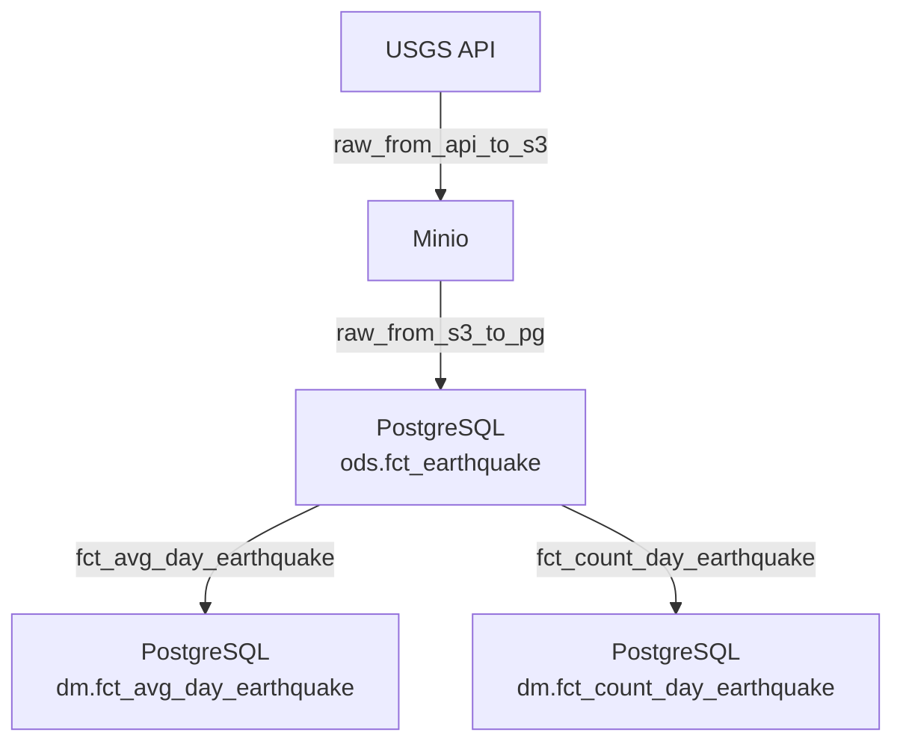

# Earthquake ETL

Репозиторий демонстрирует работу ETL-пайплайна по загрузке и агрегированию данных о землетрясениях. Проект построен на базе Apache Airflow и использует DuckDB, Postgres и Minio.

## Структура проекта

```text
earthquake_etl/
├── dags/
│   ├── raw_from_api_to_s3.py
│   ├── raw_from_s3_to_pg.py
│   ├── fct_avg_day_earthquake.py
│   └── fct_count_day_earthquake.py
├── docker-compose.yaml
├── metabase/
│   └── Dockerfile
└── requirements.txt
```

## Используемые технологии

- **Apache Airflow** – оркестрация ETL-процессов.
- **DuckDB** – загрузка данных по HTTP и копирование их в Minio/PostgreSQL.
- **PostgreSQL** – хранилище данных (слои ODS и DM).
- **Minio** – S3-совместимое хранилище файлов.
- **Metabase** – инструмент визуализации данных.


## Схема пайплайна



## Процесс работы пайплайна

1. **raw_from_api_to_s3** – DAG ежедневно обращается к `https://earthquake.usgs.gov` и сохраняет полученные CSV данные в Minio в виде Parquet-файлов.
2. **raw_from_s3_to_pg** – после появления файла в Minio данные переносятся в таблицу `ods.fct_earthquake` в PostgreSQL.
3. **fct_avg_day_earthquake** и **fct_count_day_earthquake** – на основе таблицы `ods.fct_earthquake` считаются средняя магнитуда и количество землетрясений за сутки, результаты сохраняются в схему `dm`.
4. Сервисы поднимаются через `docker-compose up -d`, после чего DAG-и можно запускать из веб‑интерфейса Airflow.

Все переменные подключения (доступ к Minio, пароль Postgres и т.д.) задаются через Airflow Variables.
